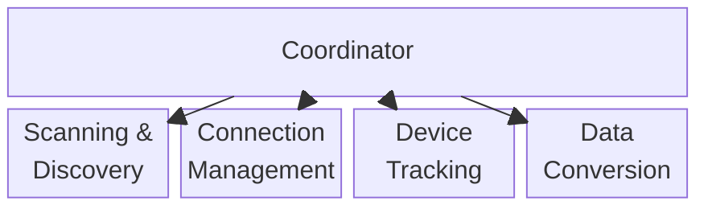
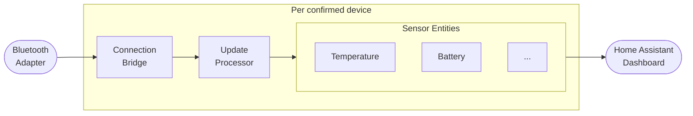
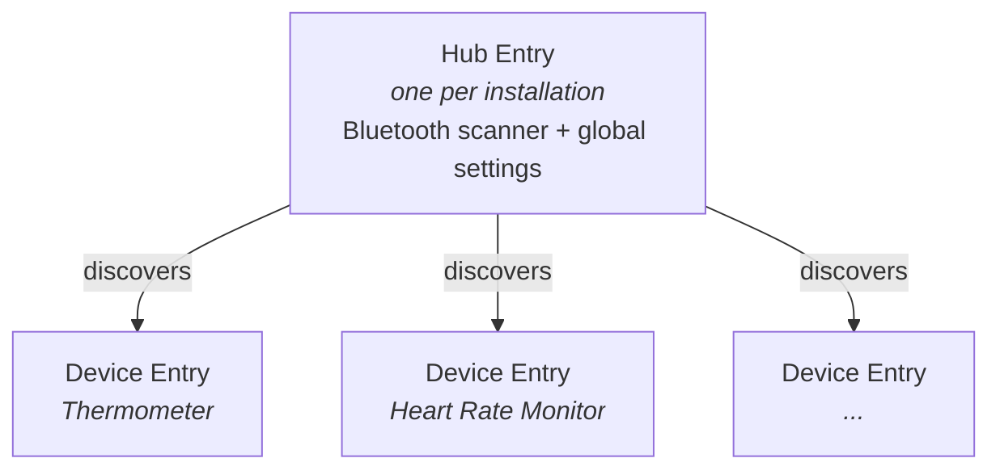
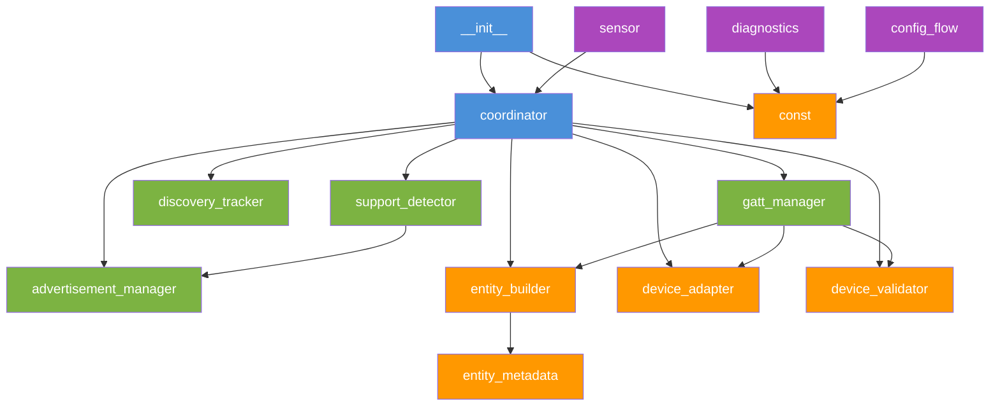

# Architecture Overview

This page explains how the integration is structured and why certain design choices were made. It is intended for users who want to understand the overall approach — for developer-level details, see the [copilot-instructions.md](https://github.com/RonanB96/ha-bluetooth-sig/blob/main/.github/copilot-instructions.md) in the repository.

## How the integration is organised

The integration has one central component that coordinates everything:

- **Scanning and discovery** — listens for Bluetooth broadcasts and determines which devices are supported
- **Connection management** — handles connecting to devices for probing and periodic reads, with limits to prevent overloading the Bluetooth adapter
- **Device tracking** — remembers which devices have been seen, confirmed, or rejected, and cleans up stale entries over time
- **Data conversion** — translates raw Bluetooth data into the format the parsing library expects

Each of these concerns is handled independently. When you see a device in the Discovered section, all four worked together to get it there.

## Per-device setup

For each device you confirm, the integration creates:

- A **connection bridge** between Home Assistant's Bluetooth stack and the parsing library
- A **processor** that receives broadcast updates and manages poll timing
- **Sensor entities** — one per characteristic (or per field within a multi-field characteristic)

## Two types of config entry

The integration creates two types of entry in Home Assistant:

- **Hub entry** — one per installation. This is what you create when you first add the integration. It runs the Bluetooth scanner and holds global settings (like the poll interval).
- **Device entries** — one per confirmed device. These are created automatically when you accept a discovered device.

This approach is needed because the integration cannot know in advance which devices you own — it discovers them at runtime based on what data they broadcast.

## Design principles

**No hardcoded device lists**: All characteristic parsing, naming, and unit assignment come from the upstream parsing library. When the library adds support for a new Bluetooth characteristic, this integration supports it automatically — no update needed here.

**Resource limits**: In environments with many Bluetooth devices, the integration limits how many devices it tracks, how many connections it opens simultaneously, and how long it remembers devices that are no longer in range. This prevents it from consuming excessive memory or radio time.

**Two data paths**: Broadcast monitoring and connected reads operate independently. This means a device that only broadcasts still works perfectly, and a device that requires connections gets polled without affecting broadcast-only devices.

## Code architecture

For contributors and advanced users, this diagram shows how the source files relate to each other:

🟦 Core &nbsp; 🟩 Managers &nbsp; 🟧 Utilities &nbsp; 🟪 Platforms / Flows
