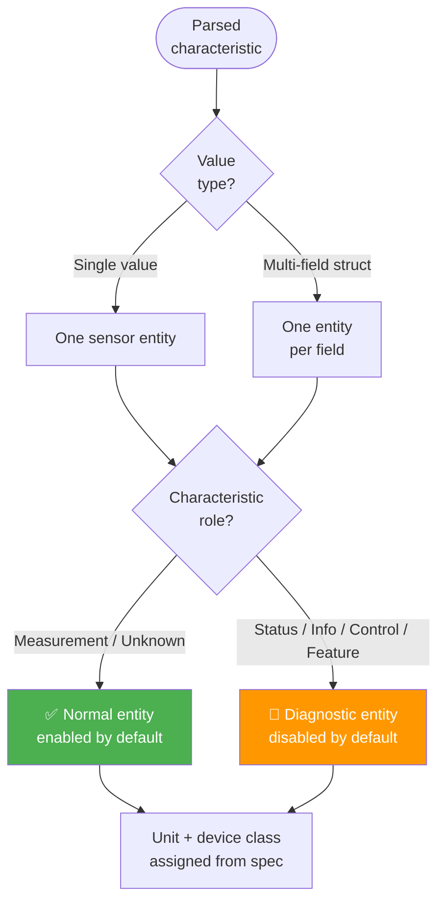

# Data Paths

This page explains how Bluetooth data from your devices becomes sensor state in Home Assistant. The integration uses two independent paths that work in parallel.

## Path 1: Broadcast data (passive)

Most Bluetooth devices periodically broadcast small packets of data (advertisements). The integration reads these broadcasts and extracts:

- **Service data** — standard Bluetooth SIG characteristics, identified by UUID (e.g., temperature, humidity, battery level)
- **Manufacturer data** — vendor-specific payloads in recognised formats

This path is **automatic** — sensor values update every time the device broadcasts, with no connection needed. Update frequency depends on how often the device advertises (typically every 1–10 seconds).

## Path 2: Connected reads (active)

Some characteristics are only available by connecting to the device and reading them directly. If the integration detected readable characteristics during device discovery, it reads them using **two triggers**:

1. **Per-device timer** — polls at the configured interval (default 5 minutes), even when Home Assistant deduplicates unchanged advertisements. Required for GATT-only devices that stop broadcasting new advert data after connect.
2. **Advertisement events** — polls promptly when a device returns to range and the poll interval has elapsed since the last read.

Both triggers share the same debouncer, so overlapping requests are coalesced. Each poll:

1. Connects to the device
2. Reads all known characteristics
3. Updates the corresponding sensor entities
4. Disconnects

The default poll interval is **5 minutes** — see [Configure the GATT poll interval](../how-to/configure-poll-interval.md) to adjust it.

To minimise connection overhead, the integration reads characteristics during the initial device probe and caches the result. The first poll returns this cached data without connecting again.

## How the paths combine

Broadcast data and connected reads typically expose different characteristics (e.g., a device might broadcast temperature but require a connection to read battery level). The integration combines both into a single unified set of sensor entities for each device.

If both paths happen to provide the same characteristic, the most recent value is used.

## How entities are created

Once data arrives from either path, the integration creates sensor entities following these rules:

1. **Simple values** (a single number or string) become one sensor entity each
2. **Multi-field values** (e.g., Heart Rate Measurement with heart rate + energy expended) are expanded into one entity per field
3. **Units and device classes** are assigned automatically based on the Bluetooth SIG specification
4. **Entity visibility** depends on the characteristic's role — see [Characteristic Roles](roles.md) for details

## Entity availability and staleness

### Broadcast path

Entities updated via broadcast data become **unavailable** if no advertisement is received from the device for approximately 15 minutes. This window is managed by Home Assistant's Bluetooth component, not by this integration directly.

When a device comes back in range, it starts advertising again and entities return to **available** on the next received advertisement.

### Connected path

GATT-polled entities follow the same availability logic. If the device cannot be reached (out of range, busy, or the connection timed out), the poll is skipped and the entity retains its last known value. It becomes unavailable if the broadcast path also stops receiving advertisements within the 15-minute window.

### Why values might not update

| Condition                       | Effect                                                            |
| ------------------------------- | ----------------------------------------------------------------- |
| Device out of range             | Entity becomes unavailable after ~15 min                          |
| Device broadcasts infrequently  | Values update slowly (normal)                                     |
| GATT poll interval is long      | Values from connected reads update slowly (adjust in hub options) |
| GATT-only device; adverts deduplicated by HA | Timer still polls at configured interval |
| GATT connection failed          | Poll is skipped; next attempt at next poll interval               |
| Characteristic not in broadcast | Value only updates during GATT polls                              |
