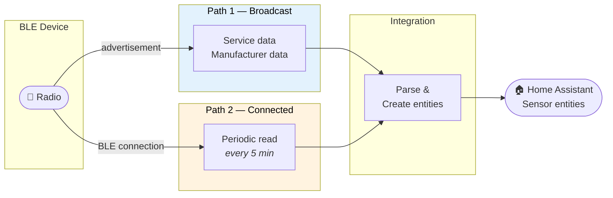
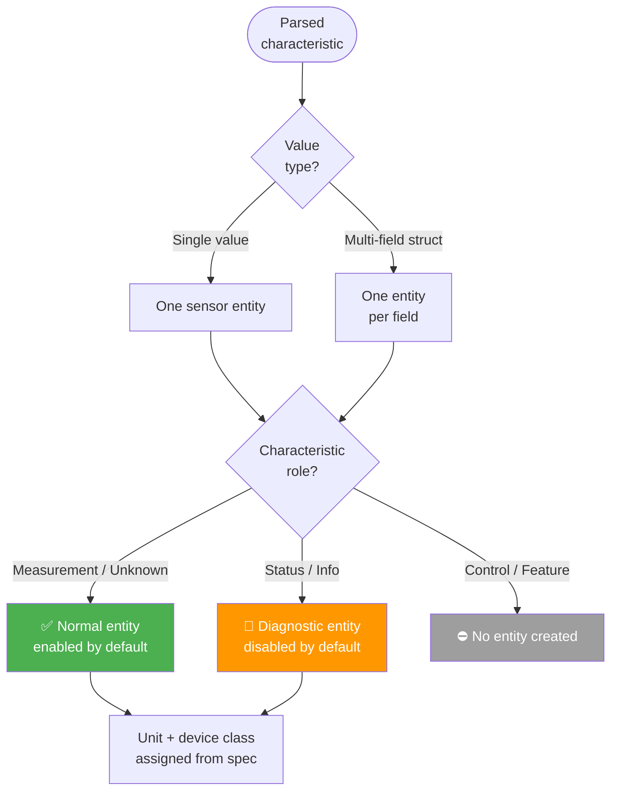

# Data Paths

This page explains how Bluetooth data from your devices becomes sensor state in Home Assistant. The integration uses two independent paths that work in parallel.

## Path 1: Broadcast data (passive)

Most Bluetooth devices periodically broadcast small packets of data (advertisements). The integration reads these broadcasts and extracts:

- **Service data** — standard Bluetooth SIG characteristics, identified by UUID (e.g., temperature, humidity, battery level)
- **Manufacturer data** — vendor-specific payloads in recognised formats

This path is **automatic** — sensor values update every time the device broadcasts, with no connection needed. Update frequency depends on how often the device advertises (typically every 1–10 seconds).

## Path 2: Connected reads (active)

Some characteristics are only available by connecting to the device and reading them directly. If the integration detected readable characteristics during device discovery, it will periodically:

1. Connect to the device
2. Read all known characteristics
3. Update the corresponding sensor entities
4. Disconnect

The default poll interval is **5 minutes** — see [Configure the GATT poll interval](../how-to/configure-poll-interval.md) to adjust it.

To minimise connection overhead, the integration reads characteristics during the initial device probe and caches the result. The first poll returns this cached data without connecting again.

## How the paths combine

Broadcast data and connected reads typically expose different characteristics (e.g., a device might broadcast temperature but require a connection to read battery level). The integration combines both into a single unified set of sensor entities for each device.

If both paths happen to provide the same characteristic, the most recent value is used.

## How entities are created

Once data arrives from either path, the integration creates sensor entities following these rules:

1. **Simple values** (a single number or string) become one sensor entity each
2. **Multi-field values** (e.g., Heart Rate Measurement with heart rate + energy expended) are expanded into one entity per field
3. **Units and device classes** are assigned automatically based on the Bluetooth SIG specification — the integration does not hardcode these
4. **Measurement characteristics** are visible by default; **status/info characteristics** are created as diagnostic entities (disabled by default); **control characteristics** are not exposed as sensors
