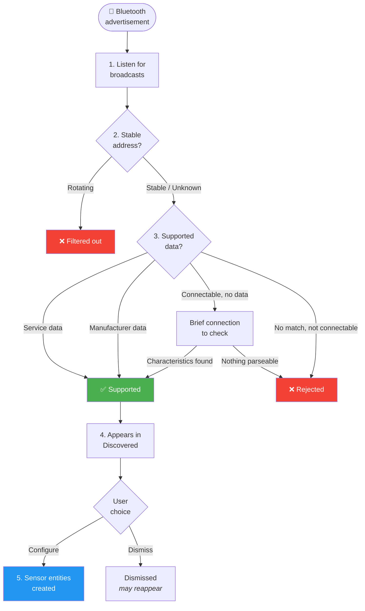

# How Discovery Works

This page explains how the integration finds Bluetooth devices and decides which ones to present for setup.

## The discovery lifecycle

### 1. Listening for broadcasts

Once you add the integration, it starts listening for Bluetooth advertisements using Home Assistant's existing Bluetooth scanner. This adds no extra radio load — it simply watches the advertisements that are already being received.

Both connectable devices (those you can connect to directly) and broadcast-only devices (those that only transmit data passively) are detected.

### 2. Filtering unstable addresses

Some Bluetooth devices rotate their address frequently for privacy reasons. The integration filters these out because:

- Entities created for a rotating address would become orphaned every time the address changes
- You would see the same physical device appear as multiple different devices

Devices with stable addresses (public or random-static) proceed to the next step. If the integration cannot determine the address type, it assumes the address is stable.

### 3. Checking for supported data

The integration checks whether the device is broadcasting data it can understand. This happens in three ways:

1. **Standard service data** — the broadcast includes data tagged with a recognised Bluetooth SIG characteristic UUID
2. **Manufacturer data** — the broadcast includes manufacturer-specific data in a recognised format
3. **Connected reading** — if the device is connectable but did not broadcast parseable data, the integration may briefly connect to check what characteristics are available (up to 3 attempts per device)

If the device does not pass any of these checks, it is ignored.

### 4. Presenting the device

When supported data is found, the device appears in **Settings → Devices & Services → Discovered**. The notification shows the device name and a summary of the detected characteristics.

You can then choose to:
- **Configure** — accept the device and create sensor entities
- **Dismiss** — ignore the device (it may reappear on a future broadcast)

### 5. Creating entities

After you confirm a device, the integration creates sensor entities for each supported characteristic. From this point:

- Sensor values update automatically whenever the device broadcasts
- If the device supports connected reads, the integration also polls it periodically (default: every 5 minutes)

### What happens to ignored devices

If a device is evaluated and no parseable data is found (including after exhausting connection attempts), it is marked as **rejected**. Rejected devices are not re-evaluated unless Home Assistant is restarted.

The rejection list is bounded to prevent excessive memory usage in environments with many Bluetooth devices.
