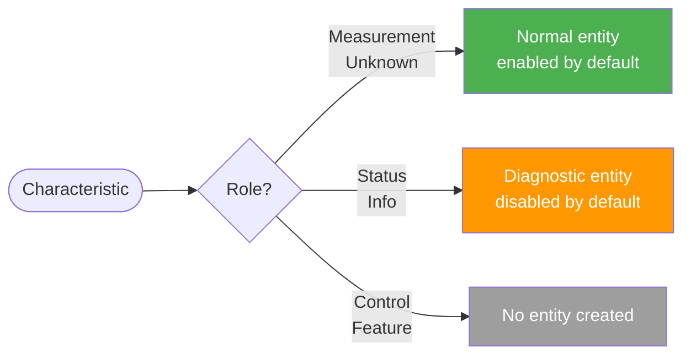

# Characteristic Roles and Entity Generation

This page explains how the integration decides which Bluetooth characteristics become Home Assistant entities, what kind of entities they become, and why some characteristics are deliberately excluded.

> This is background information for advanced users. You do not need to read this page to use the integration — entities are created automatically with sensible defaults.

## What are roles?

Every Bluetooth SIG GATT characteristic has a **role** that describes its purpose. The [bluetooth-sig-python](https://github.com/RonanB96/bluetooth-sig-python) library assigns roles automatically based on the official GATT specification data. The integration does not hardcode or override these assignments.

There are six roles:

| Role | Meaning | Examples |
|------|---------|---------|
| **Measurement** | A physical quantity or sensor reading | Temperature, Heart Rate, Battery Level |
| **Status** | Discrete device state or categorical value | Body Sensor Location, Alert Level, Ringer Setting |
| **Info** | Static metadata about the device | Firmware Revision, Serial Number, Manufacturer Name |
| **Control** | Write-only command interface | Heart Rate Control Point, Alert Notification Control Point |
| **Feature** | Device capability flags | Blood Pressure Feature, Cycling Power Feature |
| **Unknown** | Role could not be determined | Treated the same as Measurement |

## How roles are assigned

The [bluetooth-sig-python](https://github.com/RonanB96/bluetooth-sig-python) library assigns roles automatically by analysing each characteristic's official GATT specification data. The classifier uses signals such as physical units, field types, and naming conventions to determine the most appropriate role. See the [role classifier internals](https://ronanb96.github.io/bluetooth-sig-python/explanation/architecture/internals.html) for details on how the classifier works.

This approach means that as new characteristics are added to the library, they are automatically classified without any changes needed in this integration.

## How roles affect entities

The role determines whether the integration creates an entity and what kind of entity it creates:

### Measurement and Unknown roles

These create **normal sensor entities** that are visible and enabled by default on your dashboard. If the characteristic has a unit, the entity gets a `state_class` of `measurement` (or `total_increasing` for cumulative values like energy expended), which enables long-term statistics in Home Assistant.

### Status and Info roles

These create **diagnostic entities** that are disabled by default in the entity registry. They are not visible on your dashboard unless you manually enable them. This keeps dashboards clean — characteristics like Body Sensor Location or Firmware Revision are rarely needed day-to-day but are available if you want them.

To enable a diagnostic entity:
1. Go to **Settings → Devices & Services → Bluetooth SIG Devices**
2. Select the device
3. Find the entity in the disabled list
4. Select it and enable it

### Control and Feature roles

These **do not** produce entities. Control characteristics are write-only command interfaces (e.g., resetting an energy counter), and Feature characteristics describe device capabilities (e.g., which blood pressure features are supported). Neither can be meaningfully represented as a read-only sensor.

> See [Future: writable support](#future-writable-support) for how this will change.

## Value coercion

The library converts raw Bluetooth values into Python types. The integration then maps these to types that Home Assistant can display — numeric values pass through directly, enums become their name string, booleans stay as booleans, and anything else falls back to `str()`. See the [characteristics parsing guide](https://ronanb96.github.io/bluetooth-sig-python/how-to/characteristics.html) for details on the parsing and type conversion pipeline.

Multi-field characteristics (like Heart Rate Measurement, which contains heart rate, energy expended, and RR intervals) are expanded into **one entity per field**, each with its own unit and device class.

## Future: writable support

Currently, the integration is **read-only** — it monitors and measures but does not control devices. Characteristics with **Control** and **Feature** roles are skipped because they cannot be represented as read-only sensor entities.

Support for **writing to writable characteristics** is planned. When implemented:

- **Control** characteristics will become actionable entities (e.g., buttons to reset energy counters, or number inputs to set alert levels)
- **Feature** characteristics may become visible as diagnostic information about device capabilities
- This will require new Home Assistant platforms beyond `sensor` (e.g., `button`, `number`, `select`)
- The integration will need to establish BLE connections to write values, extending the existing GATT connection infrastructure

Until then, if you need to write to a Bluetooth device, you will need to use a separate tool or integration.
