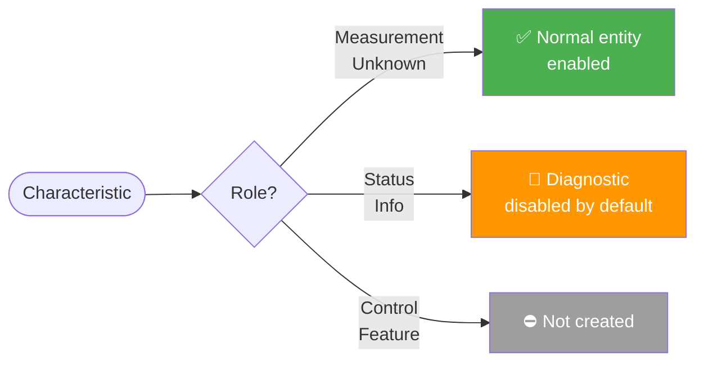

# Entities

The integration creates **sensor** entities. Each entity corresponds to a single Bluetooth SIG GATT characteristic or a field within a multi-field characteristic.

## Entity naming

Entity IDs follow the pattern **sensor.&lt;device_name&gt;_&lt;characteristic_name&gt;** — for example, `sensor.heart_rate_monitor_battery_level`.

For multi-field characteristics (e.g., Heart Rate Measurement with heart rate and energy expended fields), each field becomes a separate entity: **sensor.&lt;device_name&gt;_&lt;characteristic_name&gt;_&lt;field_name&gt;**.

## Device classes and units

Device classes and units are resolved automatically from the library's GATT registries. The integration never hardcodes these values.

### Unit-to-device-class mapping

| Unit       | Device Class         |
| ---------- | -------------------- |
| °C, K      | Temperature          |
| V          | Voltage              |
| A          | Current              |
| W          | Power                |
| J, kWh     | Energy               |
| Hz         | Frequency            |
| kg, g      | Weight               |
| lx         | Illuminance          |
| s, ms, min | Duration             |
| dBm, dB    | Signal strength      |
| hPa, mbar  | Atmospheric pressure |

### Ambiguous units

The `%` unit is disambiguated by the characteristic name:
- Name contains "battery" → **Battery** device class
- Name contains "humidity" → **Humidity** device class
- Otherwise → no device class assigned

Units like `Pa`, `ppm`, `ppb` are deliberately excluded from automatic mapping because they could apply to multiple device classes.

## State classes

| Condition                                                         | State class        |
| ----------------------------------------------------------------- | ------------------ |
| Numeric value with a unit                                         | `measurement`      |
| Field name matches a cumulative pattern (e.g., "energy_expended") | `total_increasing` |
| Diagnostic entity                                                 | No state class     |
| Non-numeric value                                                 | No state class     |

## Entity categories

Entities are categorised based on the characteristic's role in the GATT specification. Roles are assigned by the [bluetooth-sig-python](https://github.com/RonanB96/bluetooth-sig-python) library — not hardcoded in this integration. For a detailed explanation of how roles are classified and why, see [Characteristic Roles](../explanation/roles.md).

| Characteristic Role  | Entity behaviour                                                                                                                                                             |
| -------------------- | ---------------------------------------------------------------------------------------------------------------------------------------------------------------------------- |
| Measurement, Unknown | Normal sensor entity — visible and enabled by default                                                                                                                        |
| Status, Info         | Diagnostic entity — disabled by default in the entity registry. Enable manually if needed (see [troubleshooting](../how-to/troubleshooting.md#diagnostic-entities-disabled)) |
| Control, Feature     | No entity created — these are write-oriented characteristics, not suitable for read-only sensors. **Write support is planned for a future release** (see [Planned features](../index.md#planned-features) and [Characteristic Roles](../explanation/roles.md#future-writable-support)). |

## Availability

Entities become **unavailable** when the Home Assistant Bluetooth stack stops receiving advertisements from the device (typically after ~15 minutes of silence). They return to **available** when the next advertisement is received.

For GATT-polled entities, availability also depends on the success of the most recent BLE connection and characteristic read.
